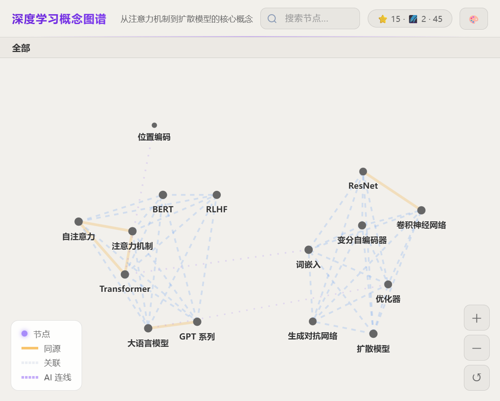
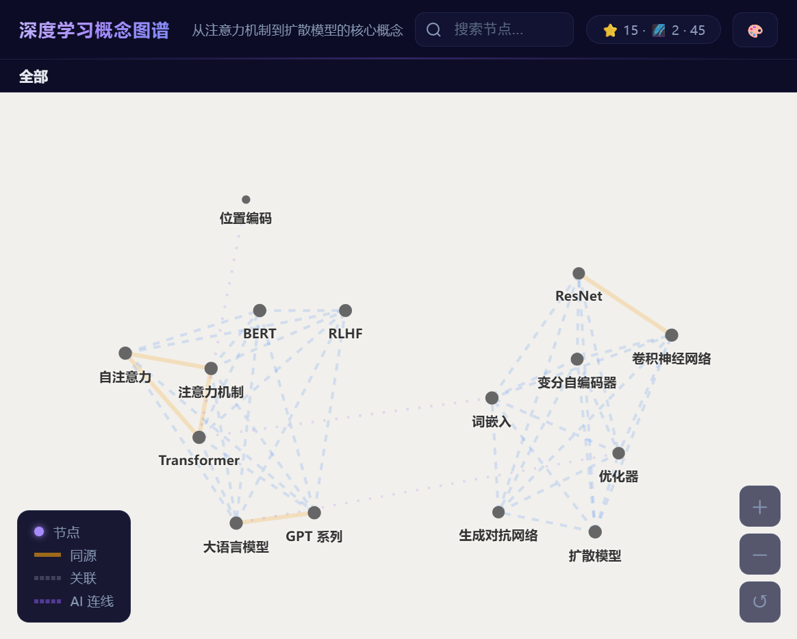

# Knowlink Page — 知识星系页面生成器

> 把"知识点数据"变成"可分享的交互式节点页面"。
> 输入 typed JSON 规范，输出自包含 HTML（内联数据 + 预计算布局坐标，浏览器端用 knowlink-core.js 渲染）。


[](https://www.npmjs.com/package/knowlink-page)
[](https://www.npmjs.com/package/knowlink-page)

[English](./README.md) · [KnowLink View（Chrome 扩展）](https://github.com/Wizeeeee/knowlink-view)

## 特性

- **零依赖**：CLI 只用 Node 内置模块，浏览器端无任何外部依赖
- **确定性渲染**：seeded RNG，相同输入产生相同布局（可做 golden 测试）
- **Schema 校验**：输入 JSON 先过校验，错误精确到字段
- **自包含输出**：单个 HTML 文件，内联数据 + 样式 + 引擎，可离线分享
- **Canvas 渲染**：缩放 / 平移 / 搜索 / 详情面板

## 效果展示

**Obsidian 主题**（默认，浅色）：



**Space 主题**（深色星空）：



## 快速开始

```bash
# 校验输入规范
node bin/knowlink-page.mjs validate examples/demo.json

# 渲染为自包含 HTML
node bin/knowlink-page.mjs render examples/demo.json out/demo.html

# 生成示例页面
node bin/knowlink-page.mjs demo
```

### 通过 npm 使用（推荐）

```bash
# 全局安装
npm install -g knowlink-page

# 校验输入规范
knowlink-page validate examples/demo.json

# 渲染为自包含 HTML
knowlink-page render examples/demo.json out/demo.html
```

> 包名：[`knowlink-page`](https://www.npmjs.com/package/knowlink-page)（npm registry）

## 命令

| 命令 | 用途 |
| --- | --- |
| `validate <input.json> [--json]` | Schema 校验（零依赖手写检查），exit 0 才通过 |
| `render <input.json> [output.html] [--json]` | 生成自包含 HTML |
| `demo [out-dir]` | 生成示例页面（默认 `examples/out/demo.html`） |
| `doctor` | 检查 skill 资产完整性 |

## 输入规范

```json
{
  "meta": { "title": "标题", "subtitle": "可选", "locale": "zh-CN|en" },
  "points": [
    { "id": "kp-1", "title": "短标题", "text": "详情文本", "url": "来源", "source": "来源名" }
  ],
  "edges": [
    { "from": "kp-1", "to": "kp-2", "strength": 80, "reason": "ai-inferred" }
  ],
  "config": { "theme": "dark", "width": 1200, "height": 800 }
}
```

完整字段语义见 [references/authoring-contract.md](./references/authoring-contract.md)，JSON Schema 见 [schemas/page.schema.json](./schemas/page.schema.json)。

### 编写守则

1. **title 是节点标签**：≤5 词最佳（渲染时截断）。text 用于关键词连线和详情面板。
2. **id 稳定**：显式边引用 point id。缺省自动生成 `kp-<i>`。
3. **边可选**：不写 edges 时引擎自动计算（同源 100 / 同域 75 / 关键词重叠 5-60）。
4. **strength 1-100**：决定边粗细和知识簇聚类（≥15 参与聚类）。
5. **≤200 个点**：超过会警告。大图建议精简或分组。

## 架构

```text
用户需求 → 写 JSON 规范
    ↓
validate（schema 校验）
    ↓
render（Node 端跑布局 → 坐标序列化 → 注入模板）
    ↓
自包含 HTML（内联 knowlink-core.js + 数据 + 样式）
```

```text
knowlink-skill/
├── SKILL.md                    Skill 定义（agent 使用入口）
├── bin/
│   └── knowlink-page.mjs         CLI（validate / render / demo / doctor）
├── lib/
│   ├── knowlink-core.js          布局 + 渲染核心（Node 端预计算 + 浏览器端渲染）
│   └── utils.js                共享工具
├── assets/
│   └── template.html           页面模板
├── schemas/
│   └── page.schema.json        输入规范 JSON Schema
├── references/
│   └── authoring-contract.md   字段语义 / 布局参数 / 修复顺序
└── examples/
    ├── demo.json               示例输入（深度学习概念图谱）
    └── out/                    生成物（gitignore，不入库）
```

## 设计要点

- **布局与渲染分离**：布局函数不碰 DOM → Node 端可预计算坐标；渲染函数浏览器端执行
- **确定性**：seeded RNG，相同输入产生相同布局，可做 golden 测试
- **零依赖**：`knowlink-page.mjs` 只用 `node:crypto` / `node:fs` / `node:path`

## 关联项目

- **[KnowLink View](https://github.com/Wizeeeee/knowlink-view)** — Chrome 扩展（Manifest V3），在浏览器中收集、管理并可视化知识点。本 skill 基于同一知识点数据模型生成可分享的 HTML 页面。

## 开发

```bash
# 运行测试
npm test

# 生成示例
npm run demo
```

### 发布到 npm

包以 **`knowlink-page`** 名称发布到 npm registry。

```bash
# 1. 升级版本号
npm version patch   # 或 minor / major

# 2. 发布（prepublishOnly 会自动先跑 npm test）
npm publish
```

## 贡献

欢迎提交 Issue 和 Pull Request！

## License

[MIT](./LICENSE)
